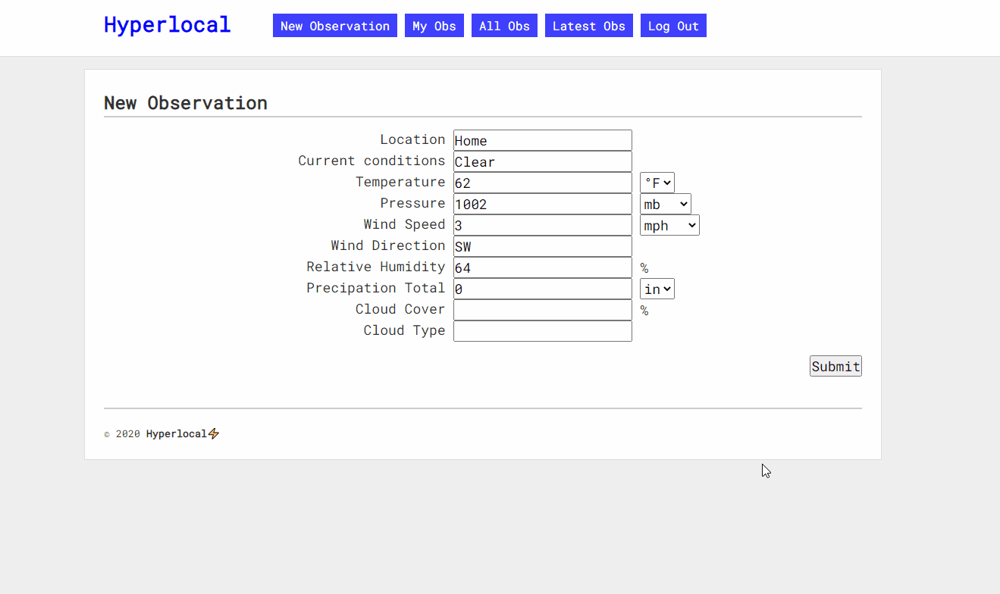

# Hyperlocal
A CRUD/MVC app to help amateur meteorologists and storm chasers track their station observations.

## Getting Started

- Clone
- Run `bundle install`
- Run `rake db:migrate`
- Run `rake db:seed` to start with sample data, if desired
- Run `shotgun` and head to http://localhost:9393

## Features

After creating an account, you can create new observations, edit or delete your entries, and view reports from all users.

## Built With

- [Sinatra](http://sinatrarb.com)
- [Active Record](https://github.com/rails/rails/tree/master/activerecord)
- [Corneal](https://github.com/thebrianemory/corneal)
- [Sinatra::Flash](https://github.com/SFEley/sinatra-flash)

## Contributing

Feel free to create a pull request if you have any ideas for expansion or improvement!

## Authors

- Ben Iburg (https://github.com/bbbtttiii)

## License

MIT Open Source (https://opensource.org/licenses/MIT)